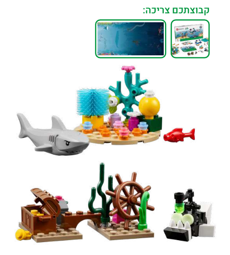
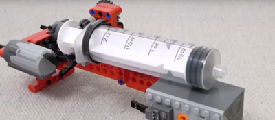
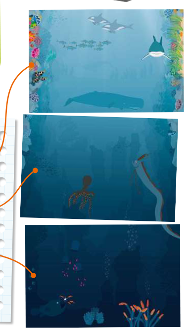

# planning

## aid resources
* [fll submerged channel](https://www.youtube.com/@firstlegoleagueofficial?si=7fT21ot2oGQKmnxMhttps://www.youtube.com/@firstlegoleagueofficial?si=7fT21ot2oGQKmnxM)
* [OceanX channel](https://www.youtube.com/@OceanX/videos)
* [noaa activity book](https://oceanservice.noaa.gov/education/discoveryourworld.html)


## 🔦 pre season - artic challenge  
* basic driving  [build artic slide](../202_driving/1_slide/readme.md)
* [convert to whell drive](../202_driving/2_roundWheel/readme.md)
    * show differential drive
* [build propeller](../102_introBuilds/windTorbine/readme.md)
* [shift with transmission](../201_transmissions/simp90dg/readme.md)
* [under see arms](https://www.youtube.com/watch?v=89gQ7-JW09Q) | [motor arms](../200_subs/arms/readme.md)


## Session1  - Oceans 

* [ocean map](https://www.mapsofworld.com/images/map-of-world-oceans.jpg)
* ocean depth  https://www.youtube.com/watch?v=A_h_atP6jBs


* 80% of oceans are unexplored

```
    what part of the oceans you and your teammates would want to explore?
    What is a submarine used for?
    What can a submarine do that a diver cannot do?
    What kinds of animals would you want to discover in the ocean?

```

🔨🔨🔨 build year's submarine model -  [sub build1](./build1.md)

🔨🔨🔨 Build the coral reef and shark models



🔨🔨🔨 [lunch the model from shore to the sea](https://education.lego.com/en-us/lessons/spikeessential-great-adventures/spikeessential-boat-trip/)

## Session2  - sea vehicles 

* [research vehicles type](./resVec.md)

🔨🔨🔨 [spike lesson underwater-quest](https://education.lego.com/en-us/lessons/spikeessential-great-adventures/spikeessential-underwater-quest/)


* pressure
    * https://www.youtube.com/watch?v=YtdEN-40tUI
    * https://www.youtube.com/shorts/P8O8fhUemQ4
    * https://www.youtube.com/watch?v=NHnv1e8cGns
    * https://www.youtube.com/watch?v=ud7w4nHgS0E
    * [how much pressure on head](https://divediscover.whoi.edu/underwater-vehicles/how-much-pressure-can-we-take/)
    * [how animal survive](https://www.youtube.com/watch?v=GOqRr08hJ6I)


🔨🔨🔨 [submarine model demo](../700_moc/presureDive/readme.md)





## Session3  - Ocean Layers

* Ocean Layers
   * https://ocean.si.edu/ecosystems/deep-sea/ocean-layers
   * https://www.timeforkids.com/k1/deep-in-sea/
   * https://www.youtube.com/watch?v=75S7Ki_q14c



```
 האזור המואר
  אזור הדמדומים
 אזור המעמקים
```


* living things are found in the sunlight zone of the ocean

```
How do we explore each zone?
what do you think lives in the deepest parts of the ocean?
What is different about animals that live in darker parts of the ocean?
What is challenging about exploring the deepest parts of the ocean?
How do humans explore the ocean and what do they need to do it?
```


🔨🔨🔨  code the model to drive front and backward 
*  modify the robot so it drives with four wheels
* change the program so the LEGO model moves in a 
different way
*  modify your model so it represents a deep sea 
vehicle
* 🔦 [assistant drive ideas](../202_driving/readme.md)


## Session4 - lights

* sunlight zone receives light that warms the water and enables plants to grow ( marine biologist )

```
What tools does a marine biologist use when studying ocean animals?

? colors?

```

🔨🔨🔨 model extend use push sensor to turn on lights (hub leds) 

🔨🔨🔨 intergrate with display/graph block 

```
?  count on grapth
? display warning image on display plot
``


## Session5 - sensors

* explore the use of lights and sensors

```
What kinds of sensors would be useful on a submarine?
How are submarines used to explore the ocean?
```

🔨🔨🔨 model extend - color sensor
   
* flash a light when a team member approaches the sensor
* attach the sensor, motor, and hub to the submarine from Session 1
* color detection:     
    When the sensor detects a black or gray object, the propeller spins quickly to back away.  
    When the sensor detects a blue or yellow object, the propeller spins slowly to move in and get a closer look


## Session6 - arms

submarine arms are used to collect samples from the ocean floor

```
what kind of arms are best for each task?

```

* [grabAndLift](../200_subs/grabAndLift/readme.md)

🔨🔨🔨 model extend add arms


##  Session7 - speed

🔨🔨🔨  Modify the boat model to different speeds

* transmissions:
    *  🔦 speed ratio TBD
    *  [simp 90 degree](../201_transmissions/simp90dg/readme.md)


## Session8 - navigation

* how do we navigate in the deepest parts ?

```
What do you hope your submarine will discover at the bottom of the ocean?

```

🔨🔨🔨 drive and navigate

* Pick two spots on the mat the submarine should visit make vehicle to move between two icons
* Can you code the robot to start in the sunlight zone and stop in the abyssal zone?
* Can you drive the robot at different speeds?


## Session9 - Deep Sea Discovery

### new creatures
Research animals that have recently been discovered.

* https://www.stem.org.uk/resources/elibrary/resource/32764/newly-discovered-species-age-7-11
* https://www.youtube.com/watch?v=UM0HpYWFEJU
* https://www.youtube.com/watch?v=jDj_KCANzMU
* https://www.youtube.com/watch?v=yPhhVqjpnKE

Imagine that your team discovers something strange while traveling through the ocean.

🔨🔨🔨 Use the prototyping pieces to build a mysterious and unknown creature.

```
what part of the ocean your creature is from and what protection it may need
How much space does your creature need?
Does your creature live in a cave or in open water?
```

## Session10 - new habitat

Artificial habitats are created by humans provide protection 
for fish and other small animals or protect a coast from erosion

🔨🔨🔨 build artificial habitat for the new species using the prototyping pieces

```
Can you draw the habitat you are going to build?
```


## Session11 - Exploration Station 

* [live underwater](https://www.usatoday.com/story/news/nation/2023/05/10/noaa-the-proteus-group-plan-underwater-space-station-for-research/70171186007/)

* prototyping pieces to build a place where people can study the ocean
* Build the tools or equipment the people might need.
* [tools used in ocean 
exploration](https://oceanexplorer.noaa.gov/technology/technology.html)

```
Does a marine biologist use different technology than a submarine pilot?
```


## Session12  - final model

build team model that shows your team’s ocean journey

* requirements:
    * exploration station
    * an artificial habitat,
    * an ocean creature
    * Motorize any part of the team mode

## Session13 - poster

create your team poster use words, drawings, and photos on your poster

* [examples](https://www.google.com/search?client=ubuntu&hs=0WK&sca_esv=d508bae1ee411921&sca_upv=1&channel=fs&sxsrf=ADLYWIIJmUgs_7TZqS3L3jWIZlL6RBlw0w:1725000015014&q=fll+poster+examples&udm=2&fbs=AEQNm0AeMNWKf4PpcKMI-eSa16lJoRPMIuyspCxWO6iZW9F1Ns6EVsgc0W_0xN47PHaanAEtg26fpfc9gg2y1-ZsywNNidIzOA0khSyMN51n7r3LlDC9M1NYStuTRDcBUYQ58dKt-Q6SigUS4Yne5yDHLg0vPBr98Nz98twIaNcnWiKaD4QuEh93Q53sB-UkWP9OcfO5KeatY98HR7cDW9ZTjFpZV7kJtA&sa=X&ved=2ahUKEwjxrYfpjZyIAxWDxgIHHfuCBX0QtKgLegQIExAB&biw=1534&bih=722&dpr=1.25)

## Session14 - presentation

prepare for your event

TBD
