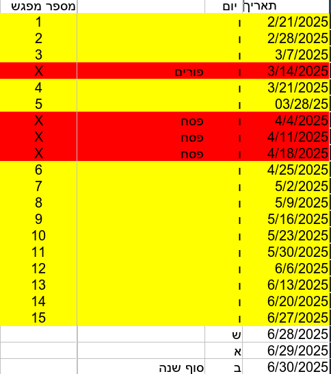

# 2025A

## dates

## objectives
* intro to basic and advanced sw control   
    * letters
    * graphs
    * debugging
* learn new techniques
* engineering case studies
* reverse engineering
* innovation
* challenge solving
* final model with presentation skills

## chapter1 intro
* [basic drive and draw](../202_driving/0_draw/readme.md)
* [rocky](../102_introBuilds/rocky/readme.md)

## chapter2 subs
* [grab](../200_subs/1_spikeGrab/readme.md)
* [lift](../200_subs/2_spikeFift/readme.md)
* [combo](https://docs.google.com/document/d/1E3PWDgcbX66xTZkQUixwI9yYMk-AUDfZHDM14jXDcPg/edit?usp=sharing)

## session1 :Autonomy
* [parking](../202_driving/4_parking/readme.md)

## session2 :Innovation
* [gap crosser campaign](../500_campaign/gapCrosser/readme.md)

## session3 :Reverse
* [PRIME Transformer](../501_transformers/atlabTransf/readme.md)

## session4 :ChallengeSolving
* [follow the line](../202_driving/3_lineFollowing/readme.md)
* [dive season challenge missions](https://www.youtube.com/watch?v=0cGKG0Q828s)
    * chosen mission1:  TBD
    * chosen mission2:  TBD

## session5 :RemoteControl
* [simulator](../502_advanced/shuttleSimulator/readme.md)

