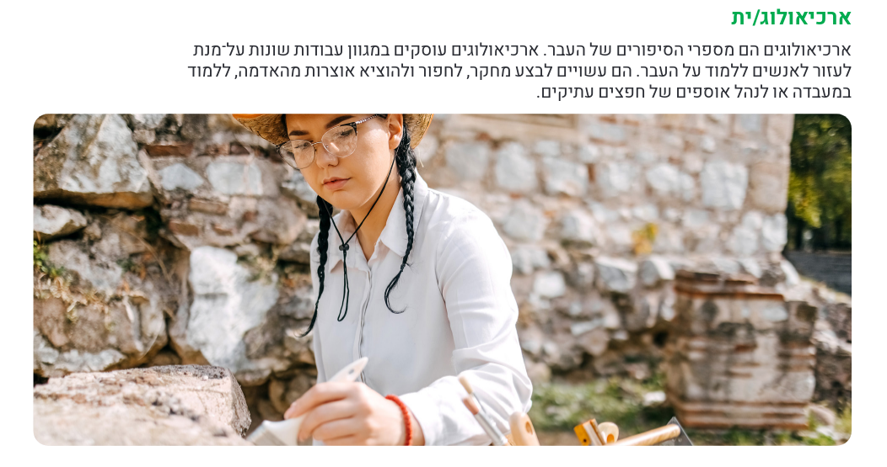
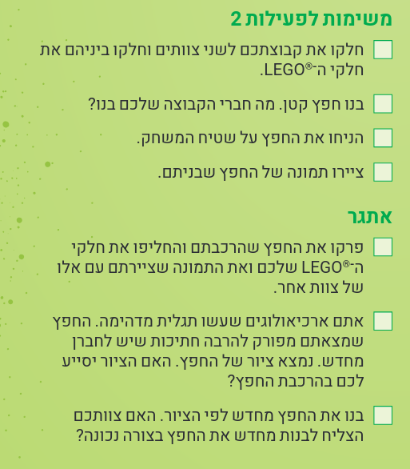
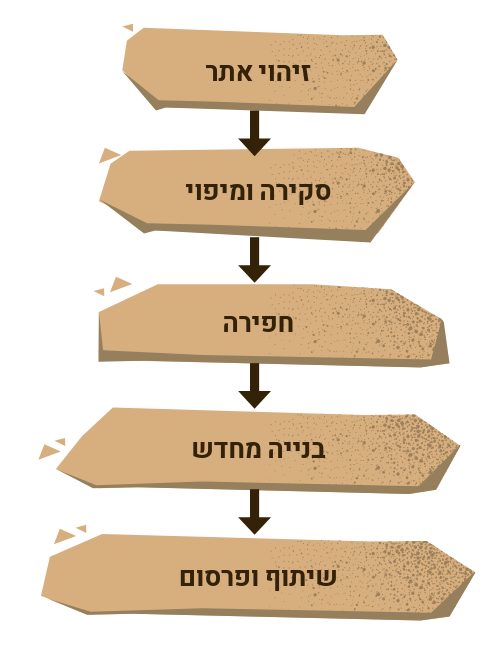
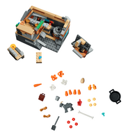
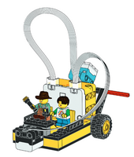
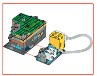

# 2026 :: UNEARTHED

```
חקרו את העבר כדי לגלות את העתיד.
```


## matrials

* [intro](./intro.md)
* [pr](./pr.md)
* [official materials](./official.md)

## links

* [The Magic School Bus](https://www.youtube.com/watch?v=eET9BNpTmWk)
* [Vocabulary List](https://www.merriam-webster.com/vocabulary/archaeology-vocabulary-list)
* [Archeology for Kids](https://www.nps.gov/subjects/archeology/archeology-for-kids.htm)
* [Archeology for Kids2](https://online.kidsdiscover.com/unit/archaeology)
* [Layers Of Soil](https://www.youtube.com/watch?v=bgqea0E2eAY)
* [Excavator](https://kids.kiddle.co/Excavator)
* [Learn Radar for Kids](https://www.youtube.com/watch?v=ppKyRyYvicg)


# 1 intro ::   הרפתקה ארכיאולוגית 
* choose name to the team
* start with the comics
* what is archaeology?

<a href="image-7.png">
  
</a>

* UNEARTHEDTM חקר הנושא

```
למידה על איך בני האדם חיו בעבר עשויה לעזור לנו לקבל החלטות טובות יותר בעתיד.
ארכיאולוגים עשויים לרצות לדעת:
מי חיו שם?
באילו כלים הם השתמשו?
מה הם אכלו?
איזה סוגי בתים הם בנו?
באילו משחקים הם שיחקו?

```

* lego 7-12 :  פעילות בנייה חופשית בנושא ארכיאולוגיה

<a href="image-8.png">
  
</a>


# 2 

* get to know  התהליך הארכיאולוגי

<a href="image-9.png">
  
</a>

```
כיצד ארכיאולוגים יודעים היכן לחפור?
מהם חלק מהכלים בהם משתמשים ארכיאולוגים?
כיצד מכ”ם יכול לעזור לארכיאולוגים למצוא חפצים?
```


* [build radar](./official.md#model1)  model from kit 1 (kit only no electronics)

```
 אילו כלים אחרים משמשים
ארכיאולוגים. אילו כלים נדרשים כדי לחפור? באילו
כלים משתמשים לתיעוד או לחקר חפצים?

```

* build kit (kit only no electronics) 2+5 :  הצלת שריד



```
דברו עם קבוצתכם על החפצים שבתוך דגם
החפירה. איך לדעתכם השתמשו בחפצים אלו?
התאמנו בהסרת שכבות ובחפירת הדגם. האם
תוכלו להרכיב אותו בחזרה?
בחנו את החדרים השונים בתוך הדגם ודונו עם
קבוצתכם כיצד השתמשו בהם.
```


# 3 - rotate and locate

הקבוצה תלמד כיצד ארכיאולוגים
משתמשים בטכנולוגיה באתר חפירות

* program skill:
    * basic: [Classic Carousel](https://education.lego.com/en-us/lessons/spikeessential-amazing-amusement-park/spikeessential-classic-carousel/) (+change spin direction)
    * advanced: ?????????????

```
דברו עם חברי הקבוצה על איך שהדגם יכול לסייע
לארכיאולוגים. אילו שינויים הייתם עושים?
```

* rebuild model to help on site :  סוקרי אתרים
    * in no other ideas : 
        * בחרו חפץ שנמצא על שטיח המשחק שמעניין
אתכם.
        * שנו את התוכנית כך שהדגם יסתובב ויעצור מעל
החפץ שבחרתם.


# les 4 : sort by sensors

הקבוצה תלמד כיצד ניתן להשתמש
בחיישנים כדי לזהות דברים
שארכיאולוגים לא יכולים לראות
באתר חפירות.
* חקר כיצד ארכיאולוגים משתמשים בטכנולוגיה

```
ארכיאולוגים משתמשים בחיישנים כדי ללמוד על חפצים מבלי לפגוע בהם.
חיישנים מסוימים יכולים לזהות אילו חומרים נמצאים בחפץ, או אם משהו מוסתר בתוכו.
```

### program skill:
* basic: [Animal Alarm](https://education.lego.com/en-us/lessons/spikeessential-great-adventures/spikeessential-animal-alarm/)
    * for spike work on voice alarm on color sensor
    * change the model to help on site : sort by color the found objects "בלשי עפר"

* advanced: ?????????????????


# 5 

הקבוצה תלמד כיצד ארכיאולוגים
מטפלים בחפצים ומזיזים אותם באתר
חפירות.

* חקר כלי רכב המשמשים באתרי חפירות

```
האם תוכלו לשנות את הרובוט כך שיסע עם ארבעה גלגלים?
האם תוכלו לבנות משאית שתעביר חומר רב מאתר החפירות?
כיצד תוכלו לתכנת את הרובוט שלכם כך שיעצור על אחד מהחפצים?
```

###  basic
* [Arctic Ride](https://education.lego.com/en-us/lessons/spikeessential-great-adventures/spikeessential-arctic-ride/)
    * change to go backward 
    * update the model to used on site
    * try : שהדגם ינוע בין שני החפצים שבחרתם. נסו לעצור את הדגם על אחד החפצים. 

### advanced: דגם חפירות
* ??? TODO


```
על הקבוצה לתרגל את מיקום הרובוט כך שיגיע למיקום מסוים על שטיח המשחק.
אתם יכולים להציב מכשול על שטיח המשחק כדי לאתגר את הקבוצה לתכנת את הרובוט שלה להסתובב.
```


# 6
הקבוצה תבנה כלים בהם משתמשים ארכיאולוגים באתרי חפירות

```
אילו כלים נדרשים לחפירה? אילו כלים נדרשים לתיעוד או לחקר חפצים?

???
להמציא כלי חדש בלגו חופשי
???

```

### build activity מחפשי אותות

```
מהו מכ"מ
תכנות דגם המכ”ם
```

* build:

  ?? TODO : spike updated instructions


# 7
הקבוצה תלמד על מקצועות הקשורים לארכיאולוגיה
* [list of proffesions](./professions.md)
```
לאילו מקומות נשלחים חפצים כדי שאנשים יוכלו ללמוד אותם?
אילו מקצועות תומכים בעבודתם של ארכיאולוגים?

בחרו במקצוע המעניין אתכם. איזה סוג של הכשרה נדרשת כדי לעסוק בו? 
באילו כליםמ שתמשים במקצוע זה?

```

* עוזרי ההיסטוריה
* חקר מקצועות ארכיאולוגיה


### build: תכנות דגם אתר החפירות
* add electronics to the model from kit 2+5:

  ?? TODO : spike updated instructions

* run the sw 
    * control speed
    * refactor the moving part mechanism in other ways
    * add custom group symbols representing the team


# les : preapre for event
* הדגם הקבוצתי
* הפוסטר הקבוצתי
* הכנה לאירוע