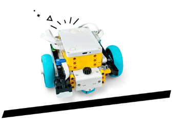
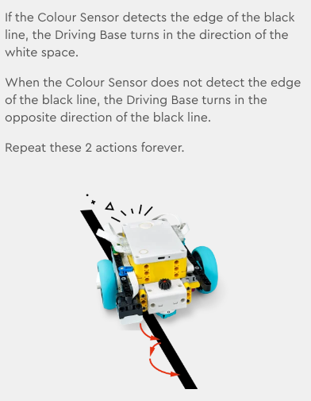

# Reacting to Lines

Write programs using the Colour Sensor to make the Driving Base autonomous.

* https://education.lego.com/en-gb/lessons/prime-competition-ready/training-camp-3-react-to-lines/

## task 1

 * drive and stop at black line

## task 2

* follow the line

