# by build model

## 201 build sequences

* [lifting 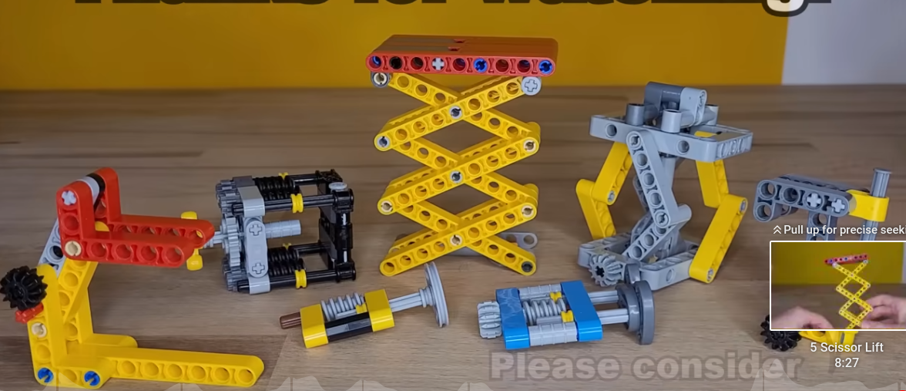](./201_build/liftting/readme.md)
* [grabAndLift 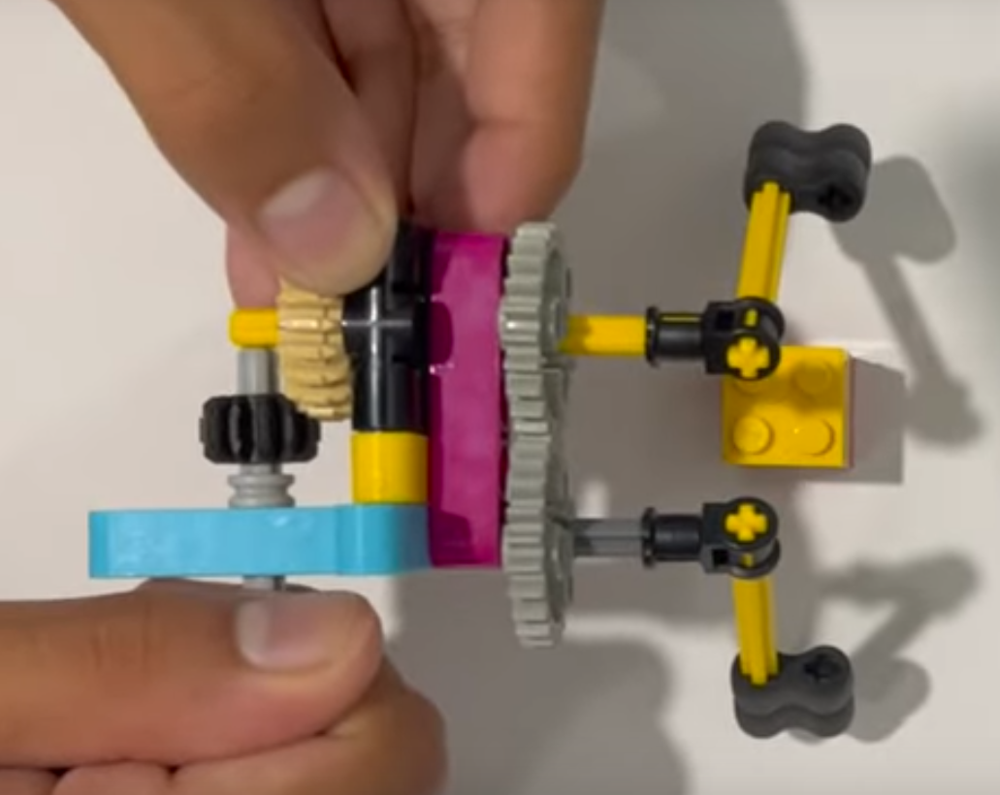](./201_build/grabAndLift/readme.md)

## 301 prime units

* [intro 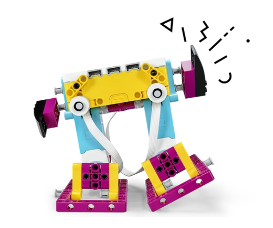](./301_primeUnits/01_intro/readme.md)
* [hopper 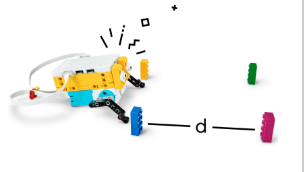](./301_primeUnits/02_hopper/readme.md)
* [cleanUp 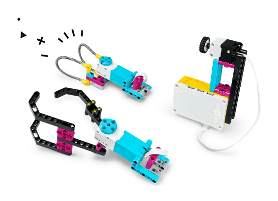](./301_primeUnits/03_cleanUp/readme.md)
    * [xxx ](./201_build/grabbers/readme.md)
    
* [fixme 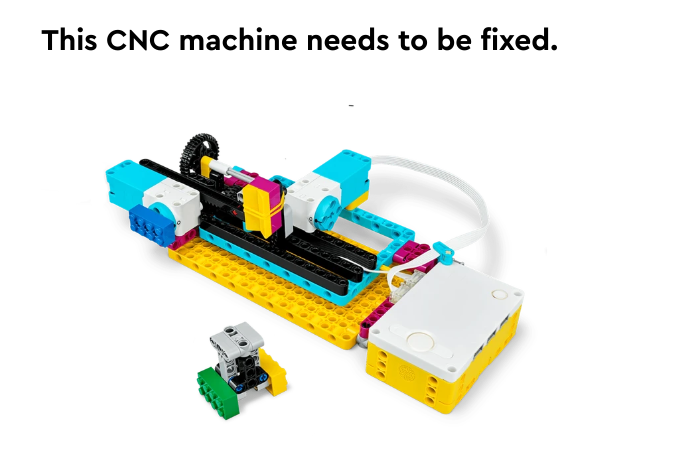](./301_primeUnits/04_brokenFix/readme.md)
* [proth 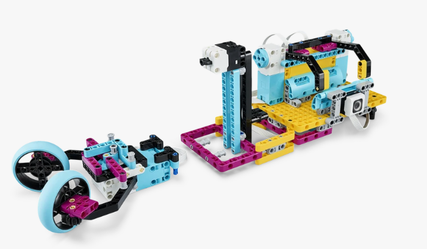](./301_primeUnits/05_prothDesign/readme.md)
* [qualityCheck_A 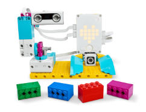](./301_primeUnits/06_qualityCheck_A/readme.md)
* [qualityCheck_B 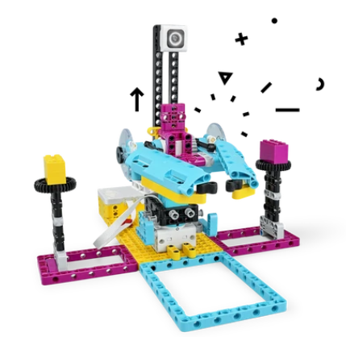](./301_primeUnits/06_qualityCheck_B/readme.md)
* [carAvoidObst 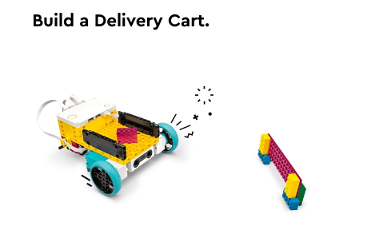](./301_primeUnits/07_carAvoidObst/readme.md)
* [breakDancer 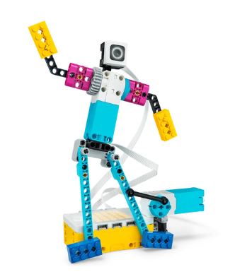](./301_primeUnits/08_breakDancer/readme.md)
* [sitUpper 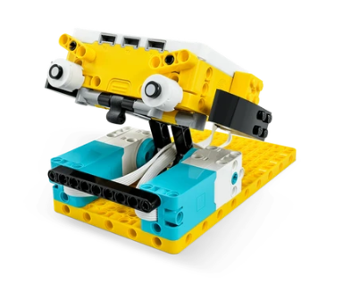](./301_primeUnits/09_sitUpper/readme.md)
* [drivingAround 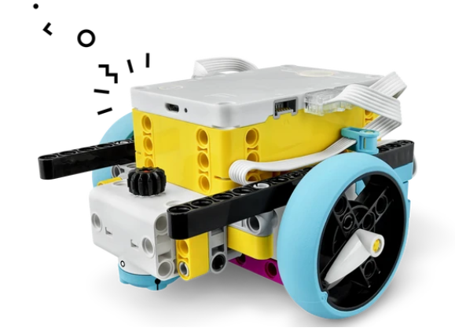](./301_primeUnits/10_drivingAround/readme.md)
* [rescue 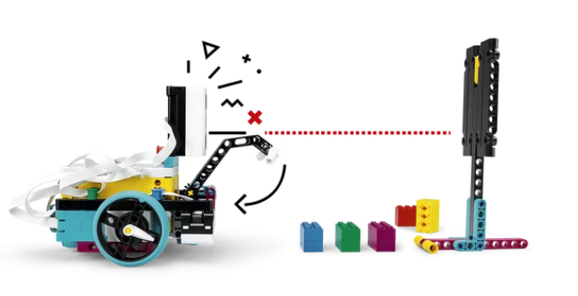](./301_primeUnits/11_rescue_objects/readme.md)
* [lineDrive 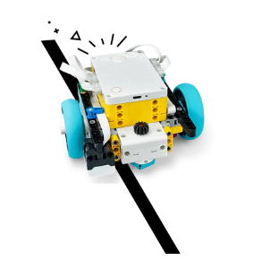](./301_primeUnits/12_lineDrive/readme.md)
* [uphill 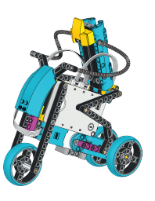](./301_primeUnits/13_uphill/readme.md)

## 402 challenges 

### animals

* [insectWalker 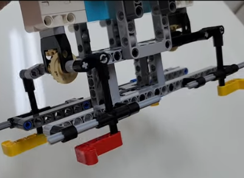](./402_challenges/1_animalMimic/insectWalker/readme.md)
* [scorpion 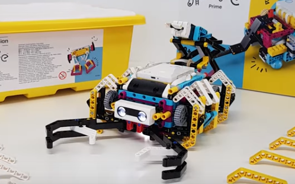](./402_challenges/1_animalMimic/scorpion/readme.md)
* [spyder 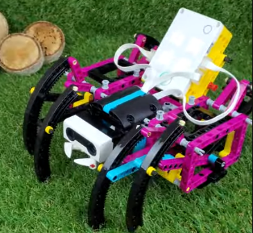](./402_challenges/1_animalMimic/spyder/readme.md)
* [worm 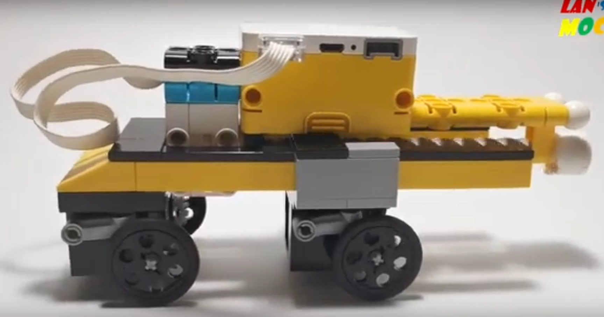](./402_challenges/1_animalMimic/worm/readme.md)

### auto car

* [gapCrosser 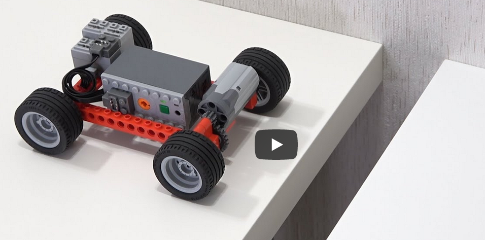](./402_challenges/2_autoCar/gapCrosser/readme.md)
* [self park 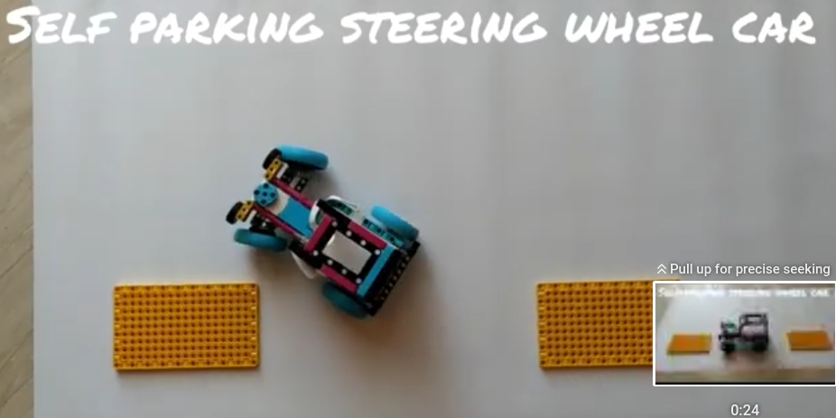](./402_challenges/2_autoCar/hotDorSelfPark/readme.md)

### transformers
* [xxx ](./402_challenges/3_transformers/atlabTransf/readme.md)

## build for fun

* [windTorbine 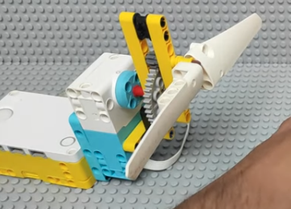](./202_buildForFun/windTorbine/readme.md)
* [helicopter 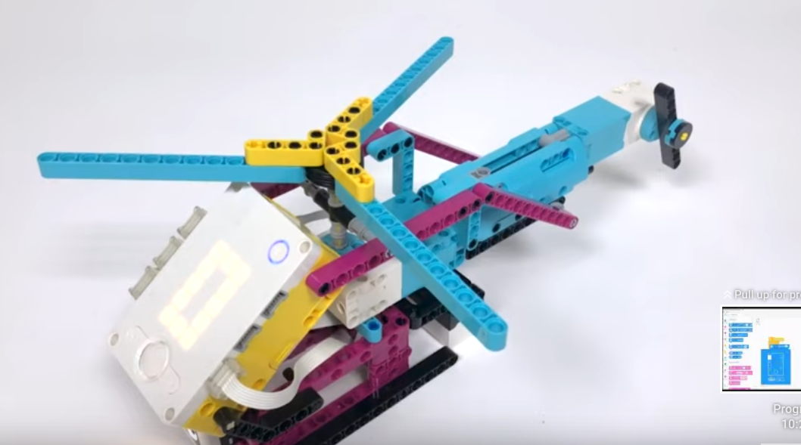](./202_buildForFun/helicopter/readme.md)
* [gymnastBot 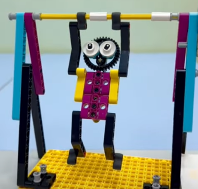](./202_buildForFun/gymnastBot/readme.md)
* [2dArtDrawing 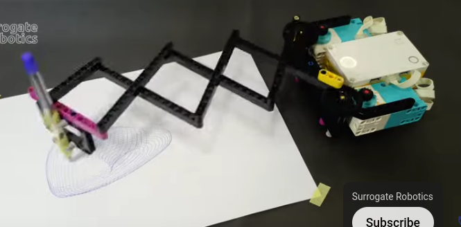](./202_buildForFun/2dArtDrawing/readme.md)

* [xxx ](./)
* [xxx ](./)
* [xxx ](./)
* [xxx ](./)
* [xxx ](./)
* [xxx ](./)