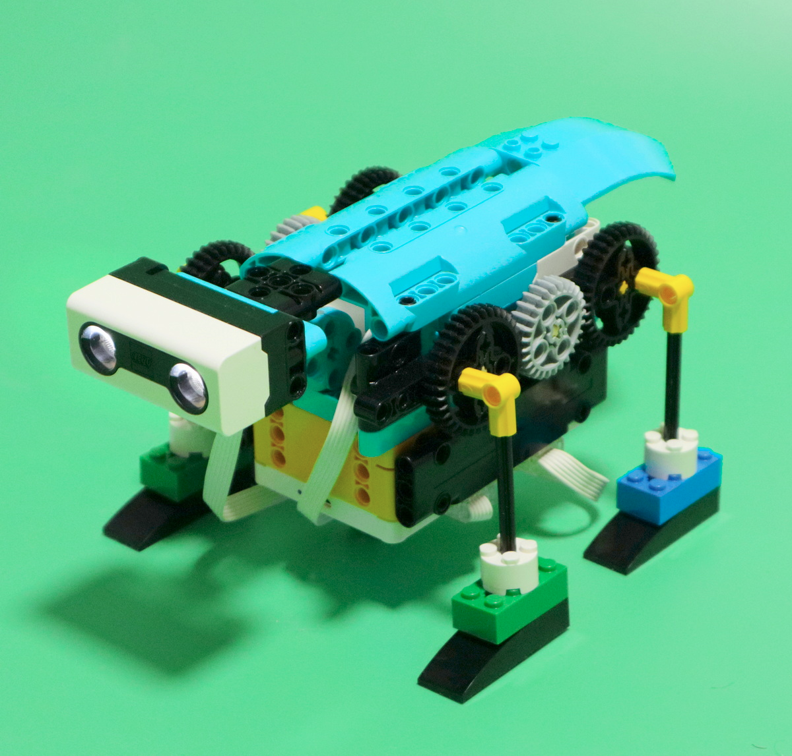

# spike

* trainings by years [2023](./2023.md)
* by [build model](./byBuildModel.md)

# training map

## intro
* [101 basic](./101_basic/readme.md) - hw controllers and basic logic

## simple logo builds
* [201 simple build](./201_build/readme.md)
* [202 build for fun](./202_buildForFun/readme.md)
* [204 mechanics](./204_mechanics/readme.md)

## lego official learn units
* [301 prime units](./301_primeUnits/readme.md) - basic lego prime units converted to icon blocks
* [302 prime extensions](./302_primeExpansion/readme.md)

## campaign
* [campaign by challenges](./402_challenges/readme.md)

## advanced
* [500 advanced builds](./500_advanced/readme.md)

## builds

